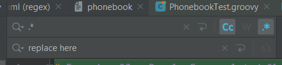

# Exercise 03 - Poorly Encapsulated Class

## Instructions
1. Open the `learn.regex.model.Person` class in IntelliJ.
2. Press `Ctrl+R` to open the find and replace function at the top of the class
3. If it's not selected click on the button `.*` to enable regex patterns in the find:



4. You may also want to turn on case sensitivity.
5. Using the find an replace function, refactor the class to fix some of the problems
6. If you want to reset the class to try a second time, the original code will be in this readme file below.
7. This can be fixed by pressing the `Replace All` only 3 times

## Problems to Fix
* [ ] The field variables are mistakenly set to either `protected` or `public` and need to be set to `private`
* [ ] The getters and setters are all mistakenly set to either `protected` or `private` and need to be `public`
* [ ] It looks like one property was accidentally set to `getHairColor`, this should probably be set to `hairColor` with all matching methods also fixed.

<details>
<summary>Original Class</summary>

```java
package learn.regex.model;

public class Person {

    public String firstName;
    public String lastName;
    
    protected int age;
    
    public String getHairColor;
    protected boolean isPrivate;

    private String getFirstName() {
        return firstName;
    }

    protected void setFirstName(String firstName) {
        this.firstName = firstName;
    }

    protected String getLastName() {
        return lastName;
    }

    protected void setLastName(String lastName) {
        this.lastName = lastName;
    }

    private int getAge() {
        return age;
    }

    private void setAge(int age) {
        this.age = age;
    }

    protected String getGetHairColor() {
        return getHairColor;
    }

    protected void setGetHairColor(String getHairColor) {
        this.getHairColor = getHairColor;
    }

    protected boolean isPrivate() {
        return isPrivate;
    }

    private void setPrivate(boolean aPrivate) {
        isPrivate = aPrivate;
    }
}
```
</details>
